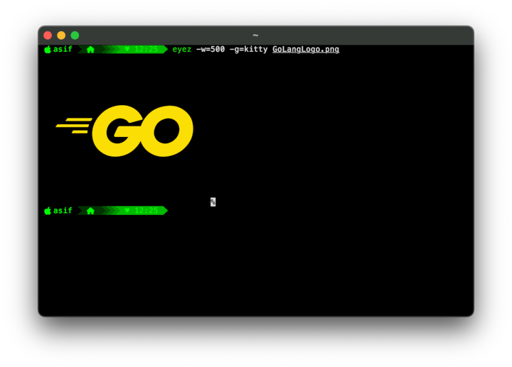

# eyez


<!--  -->
<!--  -->
<!--  -->

[](https://ko-fi.com/O5O41Y49V9)

*Eyez* is a powerful CLI tool that lets you view images directly inside your terminal — no GUI required.

It’s designed to work seamlessly with tools like `fzf`, pipes, and standard Unix workflows, making it perfect for developers who live in the terminal.



### Supported Images
- PNG
- JPG
- BMP
- GIF
- WEBP

### Features
- View images in terminal (supports most modern terminals)
- Works beautifully with `fzf` preview
- Pipe-friendly — integrates into your CLI workflows
- Fast and lightweight
- Simple and minimal interface

## Installation
Download and install executable binary from GitHub releases page.

### Using homebrew
```sh
brew tap tech-thinker/tap
brew update
brew install eyez
```

### Linux Installation
```sh
TAG=<tag-name>
curl -sL "https://github.com/tech-thinker/eyez/releases/download/${TAG}/eyez-linux-amd64" -o eyez
chmod +x eyez
sudo mv eyez /usr/bin
```

### MacOS Installation
```sh
TAG=<tag-name>
curl -sL "https://github.com/tech-thinker/eyez/releases/download/${TAG}/eyez-darwin-amd64" -o eyez
chmod +x eyez
sudo mv eyez /usr/bin
```

### Windows Installation
```sh
TAG=<tag-name>
curl -sL "https://github.com/tech-thinker/eyez/releases/download/${TAG}/eyez-windows-amd64.exe" -o eyez.exe
eyez.exe
```

## Usage
- Preview images as default width (80 char)
```sh
eyez <image>
```

- Preview images as custom width
```sh
eyez <image> <custom-width>
```

- Preview images as default width (80 char) with Pipe
```sh
cat <image> | eyez
# Or
eyez < <image> | eyez
# Or
cat <image> | eyez <width>
```

- Preview images as default width (80 char) with `fzf`
```sh
fzf --preview="eyez"
```

- Preview images as custom width with `fzf`
```sh
fzf --preview="eyez <width>"
```
